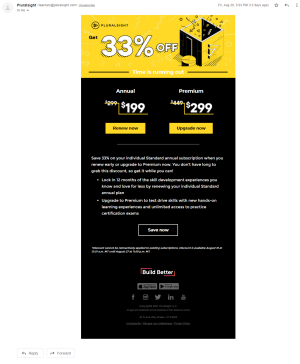

# Plural Sight Renewal Email
A renewal email from Plural Sight. Made purely with HTML and CSS and is mobile friendly.
# Completed Result
Click the image below to see the completed result.

# Notes
Just some thoughts as I built this for future projects.

## Boilerplate Email Template
Things can get quite confusing while building these emails from scratch, especially without a framework. The easiest way to keep track of which row or table you're in is to keep comments. I plan to make a quick boilerplate for those projects which don't require a framework like Foundations, or MJML.

## Mobile Queries
The original email was responsive, so I got to pay attention to the elements which changed in the mobile view (Gmail app).
* Seems like many elements doubled in size, including the pictures, buttons, and text. Some not so drastic, such as the social media icons, but it was enough to notice. Please see the [Media Queries](./assets/style.css) to see what changed.
* The only items that stacked on top of each other this time was the Annual and Premium table links, to conform to the mobile view.
* All of this was guess work - Since I cannot see the source code on mobile.

---

# Original Email Preview
Click the image below to see the full size original email.

